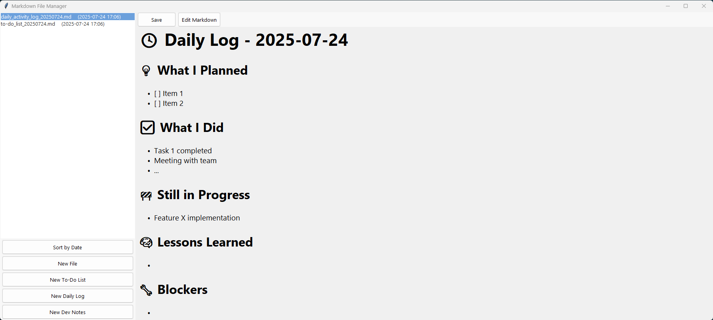

# MarkdownMate

```
          _____                    _____          
         /\    \                  /\    \         
        /::\____\                /::\____\        
       /::::|   |               /::::|   |        
      /:::::|   |              /:::::|   |        
     /::::::|   |             /::::::|   |        
    /:::/|::|   |            /:::/|::|   |        
   /:::/ |::|   |           /:::/ |::|   |        
  /:::/  |::|___|______    /:::/  |::|___|______  
 /:::/   |::::::::\    \  /:::/   |::::::::\    \ 
/:::/    |:::::::::\____\/:::/    |:::::::::\____\
\::/    / ~~~~~/:::/    /\::/    / ~~~~~/:::/    /
 \/____/      /:::/    /  \/____/      /:::/    / 
             /:::/    /               /:::/    /  
            /:::/    /               /:::/    /   
           /:::/    /               /:::/    /    
          /:::/    /               /:::/    /     
         /:::/    /               /:::/    /      
        /:::/    /               /:::/    /       
        \::/    /                \::/    /        
         \/____/                  \/____/         

```

MarkdownMate is a simple and elegant desktop application to manage and edit multiple Markdown files with ease.  
It provides a clean interface to create, edit, and render Markdown files with live preview, plus handy templates like To-Do lists, daily logs, and developer notes.

---

## Features

- Manage multiple markdown files in one place  
- Sort files by name or last modification date (dates always visible)  
- Create new markdown files with custom names  
- Use handy pre-built templates for common tasks (To-Do, Daily Log, Dev Notes)  
- Toggle between raw markdown editing and rendered HTML preview (like GitHub README style)  
- Resizable file list panel for better file name visibility  
- Scrollable editor and preview panes  
- Modern and minimalistic interface powered by Tkinter and Azure theme  

---



## Installation

1. Clone the repository or download the source code.

```bash
git clone https://github.com/yourusername/MarkdownMate.git
cd MarkdownMate
```
2. (Optional but recommended) Create and activate a virtual environment:
```
python -m venv venv
source venv/bin/activate      # Linux/macOS
venv\Scripts\activate         # Windows
```
3. Install dependencies
```
pip install -r requirements.txt
```

## Running the App 

Simply run the main Python script:

```
python main.py
```
The application window will open with a resizable interface showing your markdown files on the left and editor/preview on the right.

## Project Structure
-  main.py - Main application script

-  templates.py - Markdown templates for quick file creation

-  azure.tcl - Azure theme file for modern UI styling

-  markdown_files/ - Folder where all markdown files are saved and loaded from

-  requirements.txt - List of Python dependencies

## Dependencies
-  Python 3.8+

-  Tkinter (standard with Python)

-  tkhtmlview (for HTML preview)

-  markdown (to convert markdown text to HTML)

## Support

If you find it useful, give it a ⭐ !

Feel free to fork it or open issues for feedback and suggestions.

## Credits

This project uses the following third-party libraries and resources:

- [Azure-ttk-theme](https://github.com/rdbende/Azure-ttk-theme) — Modern and clean theme for Tkinter ttk widgets.


